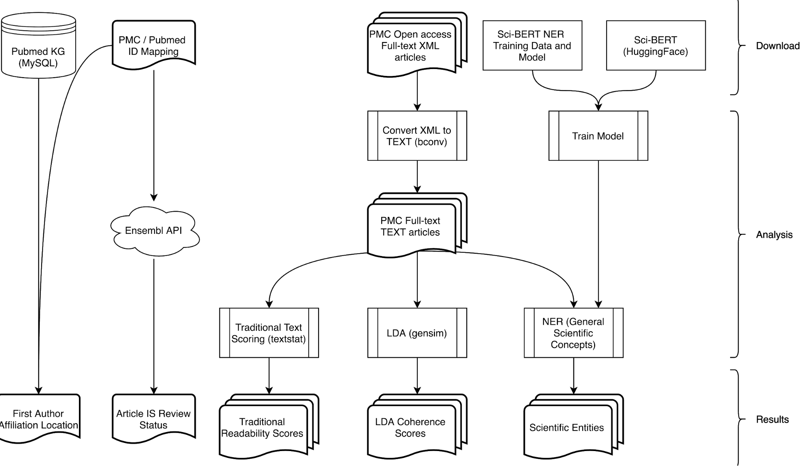

# Measuring Difficulty: Conceptual Foreknowledge Requirements and Coherence in Scientific Literature

Done as part of fufilling the course requirements for CPSC503 (UBC)

## Abstract

In the last two decades, the reading burden on researchers has increased significantly. However, asssistive tools and underlying methods for navigating the vast array of published material have not kept up with this growth. We present both a global LDA-based coherence scoring method and a supervised concept extraction framework. Together, these offer a promising solution for assessing readability and conceptual foreknowledge requirements which is applicable in supporting tools for researchers, most notably recommender systems. We evaluated our approach on large data sets of scientific literature and contrast our coherence scoring method with traditional ”shallow” readability scoring. In addition to our results, we provide a design for an open-source tool to record data on users as they browse papers.



## Data Sources

- [NCBI PMC Journal List](https://www.ncbi.nlm.nih.gov/pmc/journals/?format=csv)
- [PubMed Knowledge Graph](https://www.nature.com/articles/s41597-020-0543-2#Sec11)
- [PMC Full Text Open Access XML](https://www.ncbi.nlm.nih.gov/pmc/tools/ftp)
- [OA-STM Corpus](https://gitlab.com/TIBHannover/orkg/orkg-nlp.git)
- [GCDC Grammarly Data Set](https://github.com/aylai/GCDC-corpus)

## Getting Started

Create a virtual environment using python 3.6 or higher

```bash
python -m venv venv
source venv/bin/activate
pip install -U setuptools pip
```

Install dependencies from the requirements.txt file

```bash
pip install -r requirements.txt
```

Run the scripts. Most scripts should give a help menu if passed the `-h` flag

for example

```bash
python scripts/compute_readability_scores.py -h
```

## Analysis

The analysis pipeline is split into 2 stages: metadata collection and stats computation.

### Metadata collection

Proir to running the metadata collection. A mySQL instance of the [pubmed knowledge graph](https://www.nature.com/articles/s41597-020-0543-2#Sec11)
[database dump](http://er.tacc.utexas.edu/datasets/ped) should be up and running so it can
be pulled from.

```bash
gunzip < pubmed19.sql.gz | mysql -h <HOSTNAME> pubmed_kg -p
```

The metadata can be generated with the following

```bash
source venv/bin/activate
snakemake -s workflows/metadata.snakefile --jobs 1
```

### Text Conversion and Statistics

The PMC xml files should be uncompressed in a file with the following structure: `*/*.xml`. The
top-level directory can then be symlinked under the data directory relative to this repository.

```bash
cd data
ln -s /path/to/folder/above/xml/folders pmc_articles
```

Whereas the text conversion and downstream analysis can be done with the second pipeline file

```bash
source venv/bin/activate
snakemake -s workflows/text_stats.snakefile --jobs 10
```

This will create text files for each NXML file as well as complete stamp files in the
following pattern

| File                   | Path                                                          |
| ---------------------- | ------------------------------------------------------------- |
| complete stamp         | data/pmc_articles/{batch_id}/NXML_TXT.COMPLETE                |
| log file               | data/pmc_articles/{batch_id}.readability_scores.snakemake.txt |
| readability scores csv | data/pmc_articles/{batch_id}.readability_scores.csv           |
| text file conversion   | data/pmc_articles/{batch_id}/{article_id}.nxml.txt            |
| log file               | data/pmc_articles/{batch_id}.nxml_to_txt.snakemake.txt        |

Following text conversion, LDA coherence scoring will also be analyzed and generate files with
scores per batch.

### Labelling Scientific Concepts

The final step requires significant setup and must be run on a GPU cluster to be feasible. Therefore
we do not include that code here This creates the annotations files using the model referred to in
[Brack, 2020](https://link.springer.com/chapter/10.1007/978-3-030-45439-5_17)

This step creates the `data/pmc_articles/{batch_id}/{article_id}.nxml.txt.ann` files and takes the
`data/pmc_articles/{batch_id}/{article_id}.nxml.txt` files as input

There are two workflow files associated with this processing

- workflows/scibert-concept-extraction.snakefile
- workflows/scibert-post-processing.snakefile

The first extracts concepts from individual articles whereas the second post-processes, simplifies,
and merges the individual annotation files
